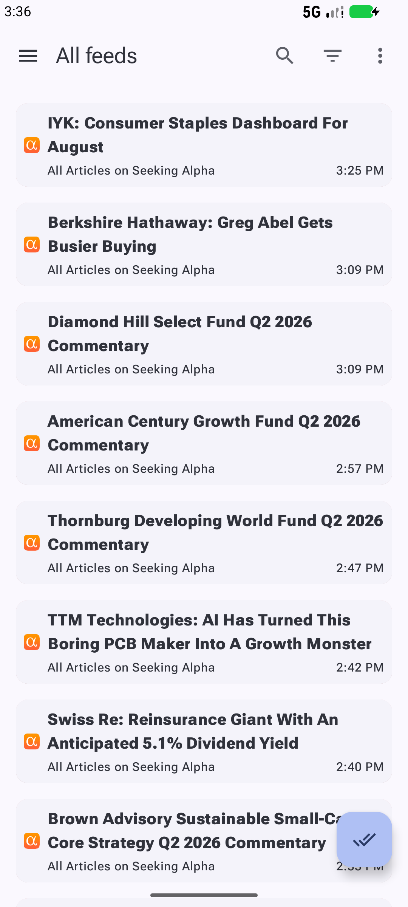
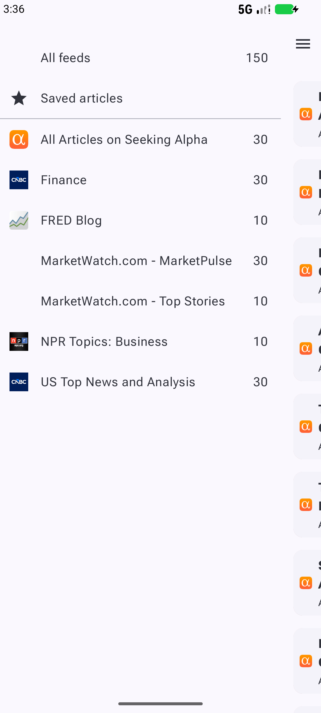
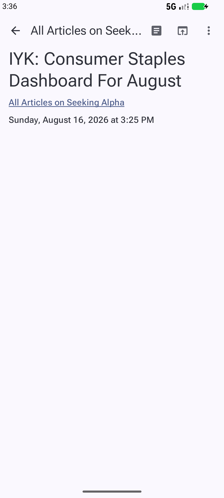
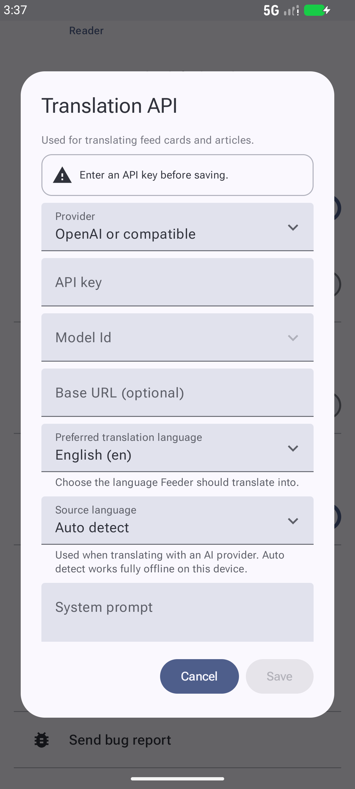
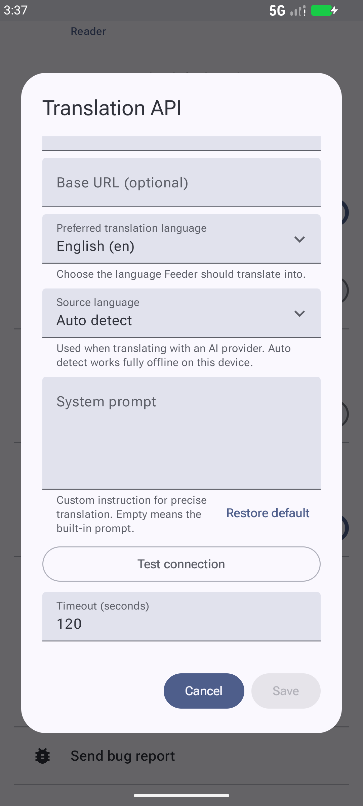
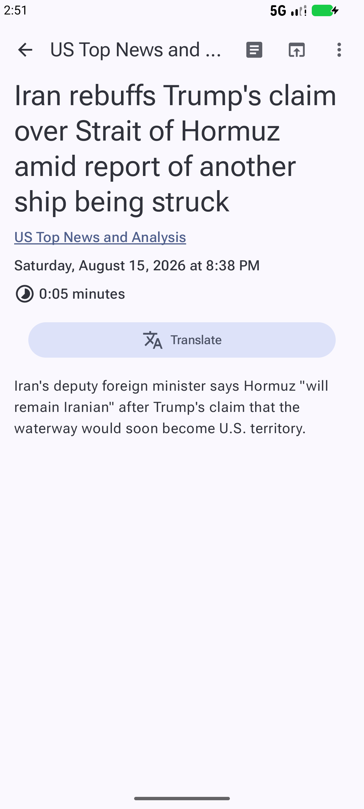

# 财经速读 · Finance Reader

[中文](README.md) | **English**

A focused reader for U.S. stock-market news: a handful of solid finance feeds come pre-loaded, and English articles translate into clean Chinese or any language in one tap — numbers, tickers, and terminology all come out right.

It's built on top of the open-source reader [Feeder](https://github.com/spacecowboy/Feeder) (GPL-3.0). Feeder is already a clean, local RSS reader; we kept all of that and layered two things on top: finance content and translation.

---

## What's supported

**Feed formats**

- RSS, Atom, and JSON Feed — paste any URL.
- OPML import / export (export doubles as a backup).
- Offline reading, unread counts, bookmarks, home-screen widgets, full-text fetching — everything Feeder already had is still there.

**System requirements**

- Android 10 (API 29) or newer, arm64 devices.
- No Google services, no account, everything runs locally.

---

## What we actually built

1. **Finance content out of the box**: on first launch it auto-subscribes 7 U.S. finance feeds (CNBC, MarketWatch, Seeking Alpha, NPR, FRED), so there's news to read immediately.

2. **AI translation with your own key**: plug in an API key, base URL and model name in Settings — DeepSeek, Kimi, Zhipu, Qwen, anything OpenAI-compatible — hit "Test connection", and you can translate full articles.

3. **Translation tuned for financial news**: the built-in prompt keeps numbers, percentages, dates, currencies, tickers and company names as-is, uses industry-standard terminology ("basis points" → "基点"), and never adds or invents anything.

4. **Offline source-language detection**: fully local (no Google services); recognizes English, Japanese, Korean, simplified/traditional Chinese and more, with a manual override. The target language follows your phone's system language by default.

5. **One-tap full-text translation**: a "Translate" button right at the top of the article translates the whole thing in one tap — no "expand first, then translate" dance. Translated articles reopen already-translated, with no repeat API cost.

6. **Long articles don't break**: oversized articles are chunked and translated piece by piece, with automatic retry on failure; translation keeps running in the background if you leave the page.

7. **Security done properly**: the API key is encrypted with the system keystore, only HTTPS is used, and the key never leaks into logs or exports.

---

## Screenshots

| Feed list | Subscriptions |
|---|---|
|  |  |

| Article | Translation settings |
|---|---|
|  |  |

| Settings (source language / prompt / test) | Top translate button |
|---|---|
|  |  |

---

## Install

1. Download `app-fdroid-release.apk` (arm64) from [Releases](../../releases).
2. Allow "install from unknown sources" and install it.
3. The app auto-subscribes finance feeds on first launch; set up your API under Settings → AI and translation → Translation API, tap "Test connection", and translate away.

See [`USER_GUIDE.md`](USER_GUIDE.md) for a detailed guide (Chinese).

## Build from source

```bash
# Requires JDK 17+ and Android SDK 36
./gradlew assembleFdroidRelease
```

See [`BUILD_GUIDE.md`](BUILD_GUIDE.md) for build, signing and versioning rules.

## License

Forked from [Feeder](https://github.com/spacecowboy/Feeder), licensed under **GPL-3.0** (see `LICENSE`).

## Credits

Thanks to the Feeder authors and community; language detection by [Lingua](https://github.com/pemistahl/lingua) (MIT), AI calls via [openai-kotlin](https://github.com/aallam/openai-kotlin) (MIT).
